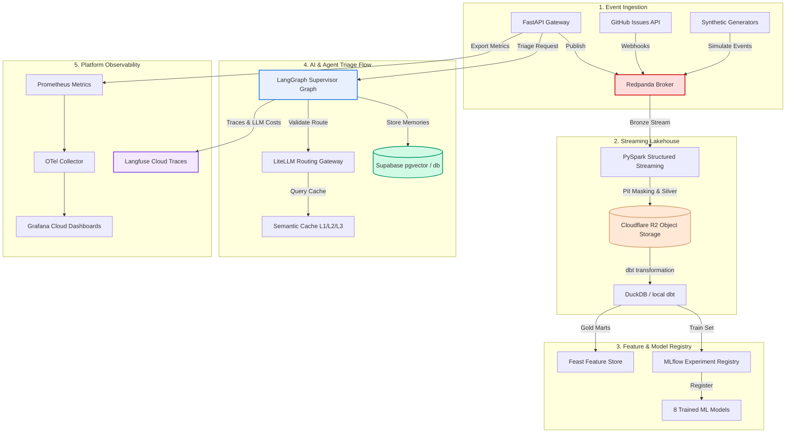

# CustomerCore System Architecture

This document provides a comprehensive technical overview of the CustomerCore platform's architecture, including its data flows, multi-agent orchestrator, and service topology.

---

## Data Flow Diagram



---

## The Nine Core Services

CustomerCore consists of nine services divided into logical layers:

### 1. Stream Ingestion
- **Technology:** Redpanda (Kafka-compatible event broker)
- **Role:** Direct ingestion points for four parallel topic streams: `tickets`, `product`, `billing`, and `incidents`. Custom python helper classes verify broker sockets before publishing.

### 2. Stream Processing
- **Technology:** PySpark Structured Streaming
- **Role:** Sub-minute micro-batch engine processing Bronze-to-Silver data. Resolves PII redaction (email, SSN, phone) using Python UDFs and guarantees strong schema enforcement before flushing to Iceberg format.

### 3. dbt Transform Layer
- **Technology:** `dbt-core` with `dbt-duckdb`
- **Role:** Compiles silver tables into 7 separate Gold business marts (customer health metrics, incident durations, billing tiers, etc.) to drive analytics and features.

### 4. Feature Store
- **Technology:** Feast (Feature Store)
- **Role:** Offline feature store manages historical training datasets; online store (Upstash Redis) provides sub-millisecond lookup latency during real-time inference.

### 5. ML Experiment Registry
- **Technology:** MLflow hosted on DagsHub
- **Role:** Trains, registers, and tracks 8 separate models including ticket classifiers (XGBoost), churn risk engines (LightGBM), volume forecasters (Prophet), and anomaly detectors (Isolation Forest).

### 6. Vector & RAG Service
- **Technology:** ChromaDB (Dense + BM25 Hybrid Retriever)
- **Role:** Holds indexed documentation and product knowledge. Realizes hybrid search with Reciprocal Rank Fusion (RRF) and reranks retrieved candidate chunks using a cross-encoder model.

### 7. Inference API Gateway
- **Technology:** FastAPI & Uvicorn
- **Role:** Public REST API endpoints handling triage requests, polling, SSE streaming, and health checks. Enforces strict JWT tenant authentication and rate-limiting.

### 8. Async Worker Service
- **Technology:** Celery + Redis
- **Role:** Manages deferred background tasks such as nightly ChromaDB backup pushes to Cloudflare R2, model cards fairness evaluations, and cache sweeps.

### 9. Platform Observability
- **Technology:** OpenTelemetry, Prometheus, Grafana Cloud, Langfuse, LangSmith, Sentry
- **Role:** Distributed tracking. Metrics collector publishes custom JVM/App metrics (18 signals, 5 dashboards). Langfuse parses token-level prompt performance.

---

## LangGraph Multi-Agent Architecture

Triage processing uses a LangGraph supervisor orchestrating six distinct sub-agents:

```text
               +-----------------------+
               |  LangGraph Supervisor |
               +-----------+-----------+
                           |
       +-------------------+-------------------+
       |                   |                   |
+------v-------+    +------v-------+    +------v-------+
|Classify Agent|    | Memory Agent |    |  RAG Agent   |
+------+-------+    +------+-------+    +------+-------+
       |                   |                   |
       +-------------------+-------------------+
                           |
       +-------------------+-------------------+
       |                   |                   |
+------v-------+    +------v-------+    +------v-------+
| Churn Agent  |    |Incident Agent|    |  HITL Agent  |
+--------------+    +--------------+    +--------------+
```

1. **Classify Agent:** Classifies tickets and evaluates initial priority.
2. **Memory Agent:** Interacts with Mem0 using Supabase pgvector to load previous tenant/customer history.
3. **RAG Agent:** Performs hybrid vector/keyword searches on product guides and draft responses.
4. **Churn Agent:** Calculates customer churn risk flags from Gold mart metrics.
5. **Incident Agent:** Detects ongoing service incidents and schedules escalation workflows.
6. **HITL (Human-in-the-Loop) Agent:** Pauses graph execution using state checkpointers if safety limits are broken, saving state for manual human review.

---

## Deployment Modes

CustomerCore is designed to support three distinct operational topologies:

| Mode | Target | Infrastructure | Inference Engine |
|---|---|---|---|
| **Lite** | Development / Testing | Docker Compose (FastAPI, Redis, Chroma) | OpenRouter LLM Cloud API |
| **Full Local** | Production Simulation | 3-Node Kind Kubernetes Cluster | Local Ollama + GPU (RTX 3050 Ti) |
| **Cloud** | Production / Portfolio | Hugging Face Spaces (Docker), Cloudflare R2, Upstash Redis, Supabase DB | Cloud API / OpenRouter |
