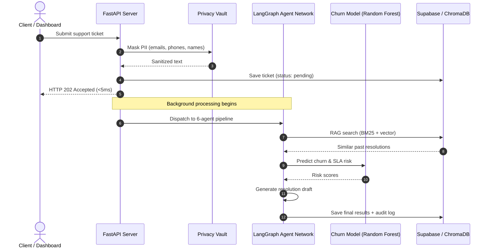
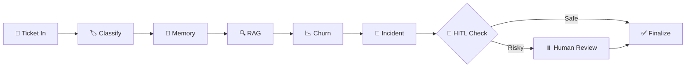

<h1 align="center">🧠 CustomerCore</h1>
<p align="center"><strong>Enterprise AI Customer Support Platform — Multi-Agent Triage, Churn Prediction & Real-Time Observability</strong></p>

<p align="center">
  
  
  
  
  
  
  
  
</p>

<p align="center">
  <a href="https://huggingface.co/spaces/saibalajiomg/customercore">🖥️ Live Demo</a> •
  <a href="https://dagshub.com/saibalajinamburi/CustomerCore.mlflow">📊 MLflow Experiments</a> •
  <a href="https://dagshub.com/saibalajinamburi/CustomerCore/models">📦 Model Registry</a> •
  <a href="https://github.com/saibalajinamburi/CustomerCore/actions">⚙️ CI/CD</a>
</p>

---

## 📌 What is CustomerCore?

CustomerCore is a **production-grade, multi-tenant B2B AI platform** that automatically triages customer support tickets using a network of 6 specialized AI agents. It classifies tickets, predicts customer churn risk, detects infrastructure outages, retrieves similar past cases, and routes everything to the right team — all in under 5 seconds.

**Not just a prototype** — it has CI/CD pipelines, containerized deployment, MLOps model tracking, LLM observability, a privacy vault for PII masking, and a Human-in-the-Loop review system for high-risk decisions.

---

## 🔗 Live Infrastructure

| Service | Link | What it does |
|:--------|:-----|:-------------|
| 🖥️ **Operations Console** | [HF Space](https://huggingface.co/spaces/saibalajiomg/customercore) | Live dashboard — submit tickets, view AI triage results |
| 📊 **MLflow Experiments** | [DagsHub](https://dagshub.com/saibalajinamburi/CustomerCore.mlflow) | Training runs, metrics, model comparison charts |
| 📦 **Model Registry** | [DagsHub Models](https://dagshub.com/saibalajinamburi/CustomerCore/models) | Versioned churn model with Production/Staging labels |
| 📂 **Dataset Versioning** | [DagsHub DVC](https://dagshub.com/saibalajinamburi/CustomerCore) | Raw + processed datasets tracked via DVC |
| ⚙️ **CI/CD Pipelines** | [GitHub Actions](https://github.com/saibalajinamburi/CustomerCore/actions) | Lint, test, train, deploy — on every push |

---

## 🏗️ How It Works — End to End



---

## 🧠 The 6-Agent Triage Pipeline

CustomerCore uses **LangGraph** to orchestrate 6 specialized agents in a sequential pipeline with conditional Human-in-the-Loop gating:



| # | Agent | What it does |
|---|-------|-------------|
| 1 | **Classify Agent** | Categorizes ticket (Billing, Technical, Security, Account) and assigns priority (Low → Critical) |
| 2 | **Memory Agent** | Recalls past interactions for this customer using Mem0 tenant-scoped memory |
| 3 | **RAG Agent** | Hybrid search — BM25 keyword + ChromaDB vector retrieval with RRF fusion to find similar resolved cases |
| 4 | **Churn Agent** | Runs customer features through our trained **Random Forest** model to predict churn probability |
| 5 | **Incident Agent** | Analyzes recent ticket frequency to detect systemic outages (spike detection) |
| 6 | **HITL Agent** | Flags tickets for human review if: confidence < 0.65, priority is critical, or safety policy is violated |

When the HITL agent flags a ticket, LangGraph's **interrupt checkpoint** pauses execution. A human operator reviews and resumes it from the dashboard.

---

## 🤖 Models — What We Built vs What We Call

### Models We Trained (Local)

| Model | Type | Task | How |
|:------|:-----|:-----|:----|
| **Churn Classifier** | Random Forest, Logistic Regression, Gradient Boosting | Predict customer churn probability | Trained on customer features (spend, tenure, ticket count, contract months). Best model auto-promoted to Production in DagsHub registry |
| **PII Detector** | spaCy NER + Microsoft Presidio | Detect and mask emails, phone numbers, names, credit cards | Runs locally in-process — data never leaves the server |

### Models We Call via API (Cloud)

| Model | Provider | When it's used |
|:------|:---------|:---------------|
| **Gemma 3 4B** | Ollama (local) | Classification, extraction, routine reasoning — 80% of tickets |
| **Llama 3.1 8B** | OpenRouter (cloud) | Complex reasoning, action-taking, high-priority tickets |

### Smart Routing Logic

The **SLA-Aware LLM Router** decides which model to use based on task type + priority:

| Task | Low/Medium Priority | High/Critical Priority |
|:-----|:-------------------|:----------------------|
| Classify | 🟢 Local (Gemma 3) | 🟢 Local (Gemma 3) |
| Extract | 🟢 Local (Gemma 3) | 🟢 Local (Gemma 3) |
| Reason | 🟢 Local (Gemma 3) | 🔵 Cloud (Llama 3.1) |
| Action | 🔵 Cloud (Llama 3.1) | 🔵 Cloud (Llama 3.1) |

> ~80% of tickets are handled locally at **$0 cost** and **<200ms latency**.

---

## 🖥️ The Dashboard (Hugging Face Space)

The live dashboard at [huggingface.co/spaces/saibalajiomg/customercore](https://huggingface.co/spaces/saibalajiomg/customercore) is a **single-page application** built with vanilla HTML/CSS/JS, served directly from FastAPI.

### What you see on the dashboard:

- **Session Context Bar** — Top bar showing Tenant, Role, and Auth status
- **AI Triage Pipeline** — Submit tickets or use 1-click demo presets
- **Prediction Cards** — Priority, Routing Team, Churn Risk, Outage Detection
- **Suggested Resolution** — AI-generated response with KB citations
- **HITL Workspace** — Review flagged tickets, approve/override AI decisions
- **System Health** — Service connectivity status (Supabase, Redis, ChromaDB)

### Understanding the Session Context:

| Field | What it means |
|:------|:-------------|
| **Tenant** | The company/organization (e.g. "Acme Corp"). All data is isolated per tenant — one tenant can never see another's tickets |
| **Role** | `support_agent` can submit tickets. `manager` can also review and approve HITL-flagged tickets |
| **Authenticated** | Green badge = valid JWT token is active. The token contains tenant_id + role, signed with HS256 |

The dashboard auto-generates a JWT when you select a tenant/role. In production, tokens would come from your auth provider (Supabase Auth, Auth0, etc).

---

## 🔐 Privacy & Security

### Cryptographic Privacy Vault

Every ticket goes through PII masking **before** it hits the database or any LLM:

```
Input:  "My email is john@acme.com and card 4111-1111-1111-1111"
Output: "My email is [EMAIL_REDACTED] and card [CREDIT_CARD_REDACTED]"
```

- Uses **Microsoft Presidio** + **spaCy** NER running locally (no cloud calls)
- Detects: emails, phone numbers, credit cards, names, SSNs
- Encryption: **AES-256-GCM** for reversible tokenization
- EU AI Act Article 10 compliant

### Authentication & Multi-Tenancy

- **JWT tokens** (HS256) carry `tenant_id` and `role` claims
- Every database query is scoped to the authenticated tenant
- Role-Based Access Control: `support_agent`, `manager`, `admin`
- Supabase Row-Level Security (RLS) enforces tenant isolation at the database layer

---

## 📊 MLOps Pipeline

### Training Flow

```
src/ml/train_churn.py
  ├── Load dataset (DVC-tracked CSV)
  ├── Feature engineering (spend, tenure, tickets, contract months)
  ├── Train 3 models: LogisticRegression, RandomForest, GradientBoosting
  ├── Log params + metrics + plots to MLflow (DagsHub)
  ├── Compare F1 scores across all models
  ├── Register best model → DagsHub Model Registry
  └── Promote to "Production" stage
```

### What gets logged to DagsHub:
- **Parameters**: n_estimators, max_depth, criterion, test_size
- **Metrics**: Accuracy, F1-Score, Recall, Precision, AUC-ROC
- **Artifacts**: ROC Curve, Confusion Matrix Heatmap, Feature Importance Chart
- **Dataset**: Registered with run for full reproducibility

### Dataset Versioning (DVC)
Datasets are tracked with **DVC** and stored on DagsHub's remote storage. `dvc push` / `dvc pull` to sync.

---

## 🏛️ Architecture — Local vs Cloud

CustomerCore runs in two modes without changing any code:

| Component | 💻 Local Mode | ☁️ Cloud Mode |
|:----------|:-------------|:-------------|
| **API Server** | `localhost:8080` (uvicorn) | Hugging Face Space (port 7860) |
| **Database** | SQLite / local ChromaDB | Supabase PostgreSQL + pgvector |
| **LLM (routine)** | Ollama → Gemma 3 4B | Ollama → Gemma 3 4B |
| **LLM (complex)** | OpenRouter → Llama 3.1 8B | OpenRouter → Llama 3.1 8B |
| **PII Masking** | Local Presidio + spaCy | Local Presidio + spaCy (in-container) |
| **Cache** | In-memory | Upstash Redis |
| **Event Queue** | Redpanda (Docker) | Async background tasks |
| **Metrics** | Prometheus + Grafana (Docker) | OpenTelemetry → Grafana Cloud |
| **LLM Tracing** | Console logs | Langfuse Cloud |
| **ML Tracking** | Local MLflow | DagsHub MLflow |

---

## ⚙️ CI/CD — GitHub Actions

Three workflows run on every push to `main`:

| Workflow | What it does |
|:---------|:------------|
| **CI/CD Pipeline** (`ci.yml`) | Lint with Ruff → Run 300+ pytest tests → Report coverage |
| **ML Training** (`train.yml`) | Train churn models → Log to DagsHub MLflow → Post CML report as PR comment |
| **HF Deploy** (`hf_deploy.yml`) | Sync code to Hugging Face Space → Rebuild Docker container → Live in ~2 min |

> Yes, all 3 workflows trigger on every push. The ML training re-runs to ensure the model registry stays in sync with code changes.

---

## 🔍 Observability Stack

### Langfuse (LLM Tracing)
Every LLM call is traced with parent-child spans: prompt → response → latency → token cost. Visible at Langfuse Cloud dashboard.

### Prometheus + Grafana (System Metrics)
Local monitoring stack with pre-built dashboard:

```bash
docker compose -f docker-compose.yml -f docker-compose.monitoring.yml up -d
# Grafana: http://localhost:3001  |  Prometheus: http://localhost:9090
```

**Dashboard panels**: Triage ingestion rate, p95 latency, LLM reliability, API costs, cache hit ratio, HITL review distribution.

---

## 📁 Project Structure

```
CustomerCore/
├── src/
│   ├── agent/                  # LangGraph supervisor + 6 agent nodes
│   │   ├── supervisor.py       # StateGraph definition, routing, checkpointing
│   │   ├── state.py            # AgentState TypedDict
│   │   ├── schemas.py          # TriageOutput Pydantic model
│   │   └── nodes/
│   │       ├── classify_agent.py
│   │       ├── memory_agent.py
│   │       ├── rag_agent.py
│   │       ├── churn_agent.py
│   │       ├── incident_agent.py
│   │       └── hitl_agent.py
│   ├── api/                    # FastAPI application
│   │   ├── main.py             # App factory, middleware, lifespan
│   │   ├── auth.py             # JWT verification, tenant extraction, RBAC
│   │   ├── ui.py               # SPA dashboard (HTML/CSS/JS)
│   │   └── routers/
│   │       ├── triage.py       # POST /triage, GET /triage/{id}
│   │       ├── health.py       # /health (liveness), /ready (readiness)
│   │       ├── metrics.py      # Prometheus metrics endpoint
│   │       └── stream.py       # SSE streaming for real-time triage updates
│   ├── rag/                    # Retrieval-Augmented Generation
│   │   ├── hybrid_retriever.py # BM25 + ChromaDB vector + RRF fusion
│   │   ├── graph_rag.py        # Graph-based RAG with DuckDB gold marts
│   │   ├── router.py           # SLA-aware multi-model LLM router
│   │   ├── llm_client.py       # LiteLLM wrapper (local + cloud)
│   │   └── multilingual.py     # Language detection + translation
│   ├── ml/
│   │   ├── train_churn.py      # Multi-model training pipeline + MLflow logging
│   │   └── deploy_to_hf.py     # Automated HF Space deployment
│   ├── responsible_ai/
│   │   ├── privacy_vault.py    # AES-256-GCM PII masking (Presidio + spaCy)
│   │   ├── constitutional_policy.py  # Input/output safety guardrails
│   │   ├── audit_log.py        # Durable audit trail
│   │   └── key_manager.py      # Encryption key management
│   ├── db/
│   │   ├── repository.py       # Supabase CRUD operations
│   │   └── migrations.py       # Auto-run DDL migrations on startup
│   ├── monitoring/
│   │   └── langfuse_tracer.py  # LLM observability integration
│   └── streaming/              # Redpanda event consumer
├── tests/
│   ├── unit/                   # 300+ unit tests across 13 test files
│   ├── integration/            # End-to-end API tests
│   └── adversarial_red_team.py # Prompt injection & jailbreak tests
├── infra/
│   ├── k8s/                    # Kubernetes manifests (deployments, services, ingress)
│   ├── monitoring/             # Grafana dashboard JSON + Prometheus config
│   └── kind-config.yaml        # Local multi-node K8s cluster config
├── .github/workflows/
│   ├── ci.yml                  # Lint + Test pipeline
│   ├── train.yml               # ML training + CML reporting
│   └── hf_deploy.yml           # Hugging Face Spaces deployment
├── docker-compose.yml          # Full local stack (ChromaDB, Redis, Redpanda, MinIO)
├── docker-compose.monitoring.yml  # Prometheus + Grafana
├── Dockerfile                  # Full production image
├── Dockerfile.hf               # Slim image for Hugging Face Spaces
└── data/                       # DVC-tracked datasets
```

---

## 🛠️ Tech Stack

| Category | Tools |
|:---------|:------|
| **API** | FastAPI, Uvicorn, Pydantic, SlowAPI (rate limiting) |
| **AI Agents** | LangGraph, LangChain, LiteLLM |
| **LLMs** | Ollama (Gemma 3 4B), OpenRouter (Llama 3.1 8B) |
| **ML Training** | scikit-learn, MLflow, DagsHub, DVC |
| **RAG** | ChromaDB, BM25 (rank-bm25), Reciprocal Rank Fusion |
| **NLP / PII** | spaCy, Microsoft Presidio, langdetect |
| **Database** | Supabase (PostgreSQL + pgvector), SQLite, DuckDB |
| **Auth** | PyJWT (HS256), RBAC, Supabase RLS |
| **Event Streaming** | Redpanda (Kafka-compatible) |
| **Caching** | Redis, Upstash Redis |
| **Observability** | Prometheus, Grafana, OpenTelemetry, Langfuse |
| **Infrastructure** | Docker, Kubernetes (Kind), Hugging Face Spaces |
| **CI/CD** | GitHub Actions, CML (Continuous Machine Learning) |
| **Data Transforms** | dbt (DuckDB adapter), PySpark |
| **Security** | AES-256-GCM encryption, Constitutional AI safety checks |

---

## 🚀 Quick Start

### 1. Clone & Install
```bash
git clone https://github.com/saibalajinamburi/CustomerCore.git
cd CustomerCore
python -m venv .venv
.venv\Scripts\activate        # Windows
pip install -r requirements.txt
```

### 2. Set Environment Variables
Copy `.env.example` to `.env` and fill in your keys:
```bash
cp .env.example .env
```

### 3. Start Local Services
```bash
docker compose up -d            # ChromaDB, Redis, Redpanda, MinIO
```

### 4. Run the API
```bash
uvicorn src.api.main:app --host 0.0.0.0 --port 8080 --reload
```
Open `http://localhost:8080` for the dashboard, or `http://localhost:8080/docs` for Swagger UI.

### 5. Run Tests
```bash
pytest tests/ -v
```

---

## 🔒 EU AI Act Compliance

| Article | Requirement | How CustomerCore implements it |
|:--------|:-----------|:------------------------------|
| **Art. 10** | Data governance & PII masking | Privacy Vault (Presidio + spaCy) masks all PII before storage or LLM calls |
| **Art. 12** | Audit traceability | Every decision logged to Supabase audit table with timestamps |
| **Art. 14** | Human oversight | HITL interrupt checkpoints pause risky decisions for human review |
| **Art. 15** | Fairness & security | Adversarial red-team tests, model cards, constitutional safety policy checks |

---

## 📄 License

MIT License — see [LICENSE](LICENSE) for details.
