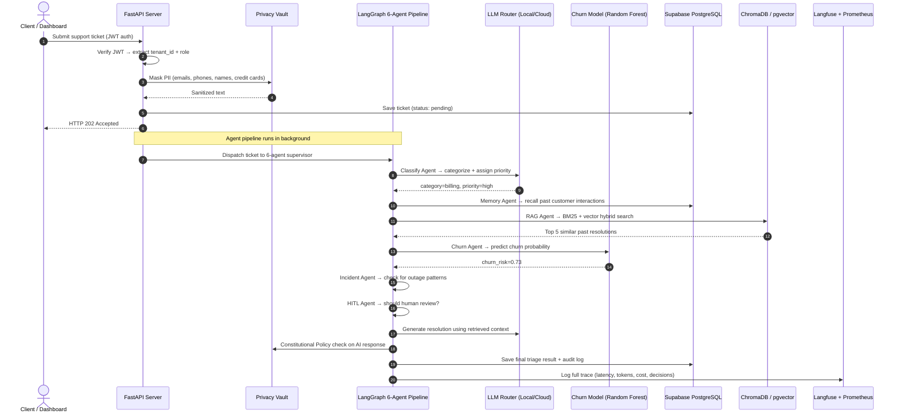
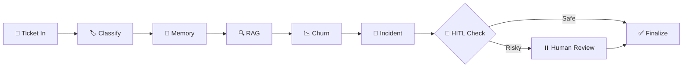
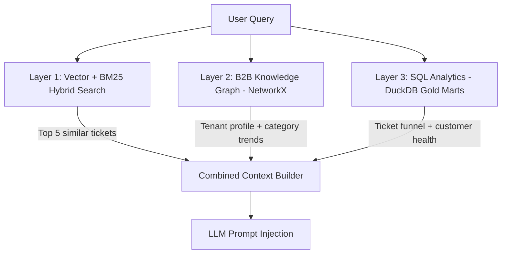

<h1 align="center">🧠 CustomerCore</h1>
<p align="center"><strong>Enterprise AI Customer Support Platform — Multi-Agent Triage, Churn Prediction & Real-Time Observability</strong></p>

<p align="center">
  
  
  
  
  
  
  
  
  
  
</p>

<p align="center">
  <a href="https://huggingface.co/spaces/saibalajiomg/customercore">🖥️ Live Demo</a> •
  <a href="https://dagshub.com/saibalajinamburi/CustomerCore.mlflow">📊 MLflow Experiments</a> •
  <a href="https://dagshub.com/saibalajinamburi/CustomerCore/models">📦 Model Registry</a> •
  <a href="https://github.com/saibalajinamburi/CustomerCore/actions">⚙️ CI/CD</a>
</p>

---

## 📌 What is CustomerCore?

CustomerCore is a **production-grade, multi-tenant B2B AI platform** that automatically triages customer support tickets using a network of 6 specialized AI agents. It classifies tickets, predicts customer churn risk, detects infrastructure outages, retrieves similar past cases, and routes everything to the right team — all in under 5 seconds.

**Not just a prototype** — it has CI/CD pipelines, containerized deployment on Hugging Face Spaces, MLOps model tracking via DagsHub, LLM observability via Langfuse, a privacy vault for PII masking, Constitutional AI safety guardrails, and a Human-in-the-Loop review system for high-risk decisions.

---

## 🔗 Live Infrastructure

| Service | Link | What it does |
|:--------|:-----|:-------------|
| 🖥️ **Operations Console** | [HF Space](https://huggingface.co/spaces/saibalajiomg/customercore) | Live dashboard — submit tickets, view AI triage results |
| 📊 **MLflow Experiments** | [DagsHub](https://dagshub.com/saibalajinamburi/CustomerCore.mlflow) | Training runs, metrics, model comparison charts |
| 📦 **Model Registry** | [DagsHub Models](https://dagshub.com/saibalajinamburi/CustomerCore/models) | Versioned churn model with Production/Staging labels |
| 📂 **Dataset Versioning** | [DagsHub DVC](https://dagshub.com/saibalajinamburi/CustomerCore) | Raw + processed datasets tracked via DVC |
| ⚙️ **CI/CD Pipelines** | [GitHub Actions](https://github.com/saibalajinamburi/CustomerCore/actions) | Lint, test, train, deploy — on every push |

---

## 🏗️ How It All Connects — End to End

This is how a single support ticket flows through the entire system:



---

## 🧠 The 6-Agent Triage Pipeline

CustomerCore uses **LangGraph** to orchestrate 6 specialized agents in a **sequential pipeline** (not a hub-and-spoke — each agent passes state to the next) with conditional Human-in-the-Loop gating:



| # | Agent | What it does | Key detail |
|---|-------|-------------|------------|
| 1 | **Classify Agent** | Categorizes ticket (Billing, Technical, Security, Account) and assigns priority (Low → Critical) | Uses LLM Router — local Gemma for routine, cloud Llama for complex |
| 2 | **Memory Agent** | Recalls past interactions for this customer | Uses **Mem0** with tenant-scoped identifiers |
| 3 | **RAG Agent** | Hybrid search — BM25 keyword + ChromaDB vector retrieval with **Reciprocal Rank Fusion** (RRF) | Optional cross-encoder reranking via `ms-marco-MiniLM-L-6-v2` |
| 4 | **Churn Agent** | Runs customer features through our trained **Random Forest** model | Features: monthly spend, tenure, ticket count, contract months |
| 5 | **Incident Agent** | Analyzes recent ticket frequency to detect systemic outages | Spike detection across the same tenant |
| 6 | **HITL Agent** | Flags tickets for human review | Triggers when: confidence < 0.65, priority is critical, or safety policy violated |

When HITL flags a ticket, LangGraph's **`interrupt_before` checkpoint** pauses execution. The state is saved in memory. A human operator reviews from the dashboard and calls `resume_triage()` to continue. The LangGraph `MemorySaver` checkpointer makes this possible — it stores the full agent state at the interrupt point so execution can resume exactly where it stopped.

---

## 🔍 RAG — How Knowledge Retrieval Works

CustomerCore doesn't use plain vector search. It uses a **3-layer Graph-RAG** system:



| Layer | What it does | Why it matters |
|:------|:-------------|:---------------|
| **Vector + BM25** | ChromaDB dense search + BM25 sparse keyword search, merged via **Reciprocal Rank Fusion** | Dense catches semantics ("frustrated" ≈ "angry"), BM25 catches exact terms ("error code 5012") |
| **Knowledge Graph** | NetworkX DiGraph connecting `Ticket → Tenant → Category` nodes | Answers "Why has acme-corp been escalating?" — pure vector search can't do this |
| **DuckDB Gold** | SQL queries on dbt-transformed Parquet marts | Returns structured analytics: ticket funnel, customer health daily, agent performance |

**Tenant Isolation**: Every ChromaDB query has a mandatory `where={"tenant_id": current_tenant}` filter. BM25 index is partitioned per tenant. Cross-tenant leakage is architecturally impossible.

---

## 🤖 Models — What We Built vs What We Call

### Models We Trained (Custom ML)

| Model | Algorithm | Task | Tracked on |
|:------|:----------|:-----|:-----------|
| **Churn Classifier** | Random Forest, Logistic Regression, Gradient Boosting | Predict customer churn probability from account features | [DagsHub MLflow](https://dagshub.com/saibalajinamburi/CustomerCore.mlflow) |

The training pipeline (`src/ml/train_churn.py`) trains all 3 models, compares F1 scores, and **auto-promotes the best one to "Production"** in the DagsHub Model Registry. Logged artifacts include ROC curves, confusion matrices, and feature importance plots.

### Models We Call via API (LLM)

| Model | Provider | When it's used |
|:------|:---------|:---------------|
| **Gemma 3 4B** | Ollama (runs locally) | Classification, extraction, routine reasoning |
| **Llama 3.1 8B** | OpenRouter (cloud API) | Complex reasoning, action-taking, high-priority |

### SLA-Aware LLM Router — Smart Model Selection

The router (`src/rag/router.py`) automatically picks the model based on task type + priority:

| Task | Low/Medium Priority | High/Critical Priority |
|:-----|:-------------------|:----------------------|
| Classify | 🟢 Local Gemma (~150ms, $0) | 🟢 Local Gemma |
| Extract | 🟢 Local Gemma | 🟢 Local Gemma |
| Reason | 🟢 Local Gemma | 🔵 Cloud Llama (frontier) |
| Action | 🔵 Cloud Llama | 🔵 Cloud Llama |

> **Result**: ~80% of tickets are handled locally at **$0 cost** and **<200ms latency**. Only complex/high-risk tickets go to cloud.

SLA latency targets per priority: Critical ≤200ms, High ≤500ms, Medium ≤1000ms, Low ≤2000ms. Violations are tracked in Prometheus metrics.

---

## 📊 Data Pipeline — How Data Flows

### Data Ingestion Strategy

We use the **stream-to-database-then-download** approach (industry standard):

```
HuggingFace Datasets (API) 
  → Stream to Redpanda (Kafka-compatible broker)
    → Bronze Consumer (raw events)
      → PII Masking (Presidio + spaCy)
        → Silver Layer (cleaned)
          → dbt transforms (DuckDB)
            → Gold Layer (analytics-ready marts)
```

**Why not download directly?** In production, data comes from APIs, webhooks, and real-time events — not static files. Streaming through a message broker (Redpanda) decouples producers from consumers, handles backpressure, and enables replay. Supabase acts as the persistent storage layer (like S3 in AWS architectures).

### Datasets Used

| Dataset | Rows | License | Language | Purpose |
|:--------|:-----|:--------|:---------|:--------|
| Bitext Customer Support | 26,872 | CDLA-Sharing-1.0 | English | SaaS support Q&A (billing, technical, account) |
| Bitext Retail Banking | 25,545 | CDLA-Sharing-1.0 | English | Financial support Q&A (card, loan, compliance) |
| Amazon MASSIVE Intent | 34,542 | Apache 2.0 | DE/FR/ES | Real multilingual customer utterances |
| **Total** | **~87,000** | | **4 languages** | |

### Medallion Architecture (Bronze → Silver → Gold)

```
Bronze (raw events from Redpanda)
  │
  ├── PII masking applied (Presidio)
  │
Silver (cleaned, PII-scrubbed events)
  │
  ├── dbt transformations (DuckDB adapter)
  │
Gold (analytics-ready marts):
  ├── customer_health_daily     — daily tenant health scores
  ├── ticket_funnel_daily       — intake/processing/resolved funnel
  ├── support_agent_performance — agent resolution metrics
  ├── billing_failure_summary   — payment failure patterns
  ├── incident_severity_hourly  — outage severity tracking
  ├── retention_cohort_metrics  — cohort-based churn analysis
  └── product_adoption_features — feature usage tracking
```

---

## 🖥️ The Dashboard (Hugging Face Space)

The live dashboard at [huggingface.co/spaces/saibalajiomg/customercore](https://huggingface.co/spaces/saibalajiomg/customercore) is a **single-page app** built with vanilla HTML/CSS/JS, served directly from FastAPI.

### What you see:

- **Session Context Bar** — Tenant, Role, and Auth status at the top
- **AI Triage Pipeline** — Submit tickets or use 1-click demo presets (billing issue, outage report, etc.)
- **Prediction Cards** — Priority, Routing Team, Churn Risk %, Outage Detection
- **Suggested Resolution** — AI-generated response with KB citations from RAG
- **HITL Workspace** — Review flagged tickets, approve or override AI decisions
- **System Health Panel** — Service status (Supabase ✅, Redis, ChromaDB)

### Understanding the Session Context:

| Field | What it means |
|:------|:-------------|
| **Tenant** | The company/organization (e.g. "Acme Corp"). All data is isolated per tenant — one tenant can never see another's tickets or data |
| **Role** | `support_agent` can submit tickets. `manager` can also review HITL-flagged tickets and override AI decisions |
| **Session / Token** | Active JWT token status. The token carries `tenant_id` + `role` claims, signed with HS256. Auto-generated on the dashboard for demo purposes |

### How Authentication Works:

1. Dashboard lets you pick a tenant + role → auto-generates a JWT (dev mode)
2. JWT payload: `{"tenant_id": "acme-corp", "role": "support_agent", "exp": ...}`
3. Every API call includes `Authorization: Bearer <token>`
4. Server verifies signature + expiry → extracts `tenant_id` → uses it for ALL data isolation
5. In production, tokens would come from Supabase Auth, Auth0, or similar

---

## 🔐 Privacy & Security

### PII Masking — Privacy Vault

Every ticket goes through PII masking **before** it hits the database or any LLM:

```
Input:  "My email is john@acme.com and card 4111-1111-1111-1111, call me at +49 170 1234567"
Output: "My email is [EMAIL_REDACTED] and card [CREDIT_CARD_REDACTED], call me at [PHONE_REDACTED]"
```

- Uses **Microsoft Presidio** + **spaCy** NER running locally in-process
- Detects: emails, phone numbers, credit cards, names, SSNs, IBANs
- Supports reversible tokenization via **AES-256-GCM** encryption (authorized users can decrypt)
- Even Langfuse traces get PII-masked before being sent to cloud

### Constitutional AI Safety Engine

An 8-rule safety engine that checks every AI response **before** it reaches the customer:

| Rule | Severity | What it catches |
|:-----|:---------|:----------------|
| PII Protection | 🔴 CRITICAL | Response leaks raw PII back |
| No Commitments | 🟡 VIOLATION | "We will refund $200 by Friday" — creates legal liability |
| Language Consistency | ⚠️ WARNING | Response in English when ticket was in German |
| Toxicity Guard | 🔴 CRITICAL | Harmful, discriminatory, or abusive language |
| AI Identity | 🔴 CRITICAL | AI denies being an AI when asked directly |
| Scope Limitation | 🟡 VIOLATION | Gives legal, medical, or financial advice |
| No Hallucination | 🟡 VIOLATION | Cites KB articles that don't exist |
| Competitor Neutral | ⚠️ WARNING | Disparages competitors by name |

Two execution paths: **Fast path** (regex, <5ms) catches obvious violations. **Slow path** (LLM-based, ~500ms) handles nuanced cases like coded language or context-dependent toxicity.

### Multi-Tenant Data Isolation

- **JWT tokens** carry `tenant_id` — every API request is cryptographically bound to a tenant
- **ChromaDB**: Metadata filter `where={"tenant_id": X}` on every query
- **BM25 Index**: Physically partitioned per tenant (separate corpora)
- **Supabase**: Row-Level Security (RLS) policies enforce isolation at the database layer
- **Role-Based Access Control**: `support_agent` < `manager` < `admin` — HITL resume requires `manager`+

---

## 📊 MLOps Pipeline

### Training Flow

```
src/ml/train_churn.py
  ├── Load dataset (DVC-tracked CSV from DagsHub)
  ├── Feature engineering (monthly_spend, tenure_months, ticket_count, contract_months)
  ├── Train 3 models:
  │   ├── Logistic Regression (baseline)
  │   ├── Random Forest (best performer)
  │   └── Gradient Boosting
  ├── Log params + metrics + artifact plots to MLflow @ DagsHub
  ├── Compare F1 scores across all models
  ├── Register best model → DagsHub Model Registry
  └── Auto-promote to "Production" stage
```

### What gets logged to DagsHub MLflow:
- **Parameters**: n_estimators, max_depth, criterion, test_size, random_state
- **Metrics**: Accuracy, F1-Score, Recall, Precision, AUC-ROC
- **Artifacts**: ROC Curve, Confusion Matrix Heatmap, Feature Importance Chart
- **Dataset**: Registered as an MLflow dataset input for full reproducibility

### Dataset Versioning (DVC)
Datasets are tracked with **DVC** and stored on DagsHub's S3-compatible remote. `dvc push` / `dvc pull` to sync. The `.dvc` files in the repo are pointers to the actual data files.

---

## 🏛️ Architecture — Local vs Cloud

CustomerCore runs in two modes **without changing any application code** — the same business logic works in both:

| Component | 💻 Local Dev Mode | ☁️ Cloud Mode (HF Spaces) |
|:----------|:------------------|:--------------------------|
| **API Server** | `uvicorn` on `localhost:8080` | Docker container on HF Space (port 7860) |
| **Database** | SQLite file (`customercore.db`) | **Supabase PostgreSQL** (cloud-managed) |
| **Vector Store** | In-process ChromaDB (Docker) | **Supabase pgvector** |
| **LLM (routine)** | Ollama → Gemma 3 4B (local GPU/CPU) | Ollama → Gemma 3 4B |
| **LLM (complex)** | OpenRouter → Llama 3.1 8B | OpenRouter → Llama 3.1 8B |
| **PII Masking** | Local Presidio + spaCy | Local Presidio + spaCy (in-container) |
| **Cache** | Redis (Docker container) | **Upstash Redis** (serverless) |
| **Event Streaming** | **Redpanda** broker (Docker) | Async background tasks |
| **Object Storage** | **MinIO** (S3-compatible, Docker) | DagsHub DVC remote |
| **Metrics** | Prometheus + Grafana (Docker) | OpenTelemetry → Grafana Cloud |
| **LLM Tracing** | Console debug logs | **Langfuse Cloud** (full trace UI) |
| **ML Tracking** | Local MLflow server | **DagsHub MLflow** (cloud) |
| **Secrets** | `.env` file | **Doppler** (secrets management) + HF Space Secrets |
| **Deployment** | `uvicorn --reload` | GitHub Actions → HF Space (auto-deploy) |

### How Cloud Mode Works (HF Spaces):

1. Push to `main` branch triggers GitHub Actions
2. `hf_deploy.yml` workflow syncs code to HF Space repo
3. HF builds the Docker image from `Dockerfile.hf`
4. Container starts: runs database migrations → starts uvicorn → serves dashboard
5. Secrets (Supabase URL, API keys, etc.) are injected as HF Space secrets
6. Supabase handles persistent data — the HF container is stateless
7. Readiness check: `/ready` endpoint validates Supabase connectivity

### Why Some Services Are "Degraded" in Cloud:

In the HF Space, Redis and ChromaDB show as "offline" in the health check — this is expected. The cloud mode uses Supabase pgvector instead of ChromaDB, and Upstash Redis instead of local Redis. The `/ready` endpoint returns 200 as long as Supabase (the critical service) is connected.

---

## ⚙️ CI/CD — GitHub Actions

Three workflows run automatically:

| Workflow | Trigger | What it does |
|:---------|:--------|:------------|
| **CI Pipeline** (`ci.yml`) | Push to `main` or PR | Install deps → Lint with **Ruff** → Run **pytest** (300+ tests) → Upload failure logs |
| **ML Training** (`train.yml`) | Push to `main` | Train churn models → Log to DagsHub MLflow → Post **CML report** as PR comment with metrics |
| **HF Deploy** (`hf_deploy.yml`) | Push to `main` | Sync entire repo to Hugging Face Space → Triggers Docker rebuild → Live in ~2 min |

> **Note**: All 3 workflows trigger on every push to `main`, including README changes. The ML training re-run ensures model registry stays in sync. If you only want to update docs without triggering training, you can push to a non-main branch first.

---

## 🔍 Observability Stack

### Langfuse — LLM Observability

Every LLM call is traced with a hierarchical structure:

```
Trace: "ticket-triage" (one per request)
  └── Span: "classify_agent"
       └── Generation: "gemma3-4b" (model, prompt, completion, tokens, cost, latency)
  └── Span: "rag_agent"
       └── Event: "rag_retrieval" (query, num_results, cache_hit)
       └── Generation: "llama-3.1-8b"
  └── Score: constitutional_compliance = 0.95
  └── Score: resolution_quality = 0.82
  └── Score: rag_grounding = 1.0
```

- PII is stripped from all trace data before sending to Langfuse
- **LiteLLM integration**: `litellm.success_callback = ["langfuse"]` auto-traces every LLM call — zero code changes needed
- Graceful degradation: when Langfuse keys are absent, NoOp stubs are used — tests pass offline

### Prometheus + Grafana — System Metrics

```bash
docker compose -f docker-compose.yml -f docker-compose.monitoring.yml up -d
# Grafana: http://localhost:3001  |  Prometheus: http://localhost:9090
```

Pre-built dashboard panels:
- 📈 **Triage ingestion rate** — tickets/second (success vs pending vs error)
- ⏱️ **p95 latency profiles** — duration distribution by priority
- 🤖 **LLM call reliability** — volume by model type and status
- 💰 **LLM cost tracker** — cumulative API spend in USD
- 🎯 **Semantic cache hit ratio** — L1/L2 cache performance
- 🛑 **HITL reason distribution** — why tickets are being flagged

### OpenTelemetry Collector

The OTel collector (`infra/otel-collector.yaml`) scrapes Prometheus metrics from the FastAPI `/metrics` endpoint and forwards them to Grafana Cloud for cloud-mode observability.

---

## 🌐 Multilingual Support

CustomerCore supports **4 languages** out of the box: English, German, French, Spanish.

- **Language detection**: `langdetect` library identifies the ticket language
- **Translation**: Multilingual model translates non-English tickets before classification
- **Response language**: Constitutional AI policy ensures the response matches the ticket language
- **Training data**: Amazon MASSIVE dataset provides real customer utterances in DE/FR/ES (not translations — real native utterances)

---

## 🧪 Testing

### Test Categories

| Type | Files | What it covers |
|:-----|:------|:--------------|
| **Unit Tests** | 13 files in `tests/unit/` | Every module: API routes, agents, RAG, vault, policy, router, multilingual, supervisor, streaming |
| **Integration Tests** | `tests/integration/` | End-to-end API flows with real HTTP calls |
| **Adversarial Red Team** | `tests/adversarial_red_team.py` | Prompt injection, jailbreak attempts, PII extraction attacks |

### Running Tests

```bash
pytest tests/ -v                    # All tests
pytest tests/unit/ -v               # Unit only
pytest tests/adversarial_red_team.py -v  # Security tests
```

---

## 🏗️ Infrastructure

### Docker Compose Stack (Local)

```bash
docker compose up -d    # Start everything
```

| Service | Port | Purpose |
|:--------|:-----|:--------|
| **Redpanda** | 9092 | Kafka-compatible message broker |
| **Redpanda Console** | 8080 | Visual dashboard for topics/messages |
| **MinIO** | 9000/9001 | S3-compatible object storage |
| **ChromaDB** | 8000 | Vector database for RAG |
| **Redis** | 6379 | Semantic cache + rate limiter |
| **OTel Collector** | 4317/4318 | Telemetry pipeline |

### Kubernetes (Production-Ready)

K8s manifests in `infra/k8s/`:
- `namespace.yaml` — `customercore` namespace
- `fastapi-deployment.yaml` — 2-replica deployment with health probes
- `secrets.yaml` — Doppler-injected secrets
- `ingress.yaml` — NGINX ingress for external access
- `pdb.yaml` — Pod Disruption Budget (min 1 available)

Can be deployed to a local Kind cluster (`infra/kind-config.yaml`) or any cloud K8s.

---

## 🔑 Secrets Management

All secrets are managed via **Doppler** (cloud secrets manager):

```bash
doppler run -- uvicorn src.api.main:app    # Injects all secrets as env vars
doppler run -- python src/ml/train_churn.py # Same for training
```

Required secrets (set in Doppler or as env vars):
- `SUPABASE_URL`, `SUPABASE_ANON_KEY`, `SUPABASE_SERVICE_ROLE_KEY`
- `OPENROUTER_API_KEY` (for cloud LLM calls)
- `LITELLM_MASTER_KEY` (also used as JWT signing key)
- `LANGFUSE_PUBLIC_KEY`, `LANGFUSE_SECRET_KEY`
- `MLFLOW_TRACKING_USERNAME`, `MLFLOW_TRACKING_PASSWORD` (DagsHub)
- `HF_TOKEN` (for Hugging Face deployment)
- `UPSTASH_REDIS_URL` (cloud Redis)

---

## 📁 Project Structure

```
CustomerCore/
├── src/
│   ├── agent/                        # LangGraph multi-agent triage
│   │   ├── supervisor.py             # StateGraph: 6 nodes + HITL interrupt + MemorySaver
│   │   ├── state.py                  # AgentState TypedDict (shared state across all agents)
│   │   ├── schemas.py                # TriageOutput Pydantic model (validated output)
│   │   └── nodes/
│   │       ├── classify_agent.py     # Ticket categorization + priority assignment
│   │       ├── memory_agent.py       # Mem0 tenant-scoped customer memory recall
│   │       ├── rag_agent.py          # Hybrid retrieval + resolution generation
│   │       ├── churn_agent.py        # ML model inference for churn prediction
│   │       ├── incident_agent.py     # Outage spike detection
│   │       └── hitl_agent.py         # Human-in-the-loop gating logic
│   ├── api/                          # FastAPI application layer
│   │   ├── main.py                   # App factory, CORS, lifespan events
│   │   ├── auth.py                   # JWT verification + RBAC + tenant extraction
│   │   ├── ui.py                     # SPA dashboard (HTML/CSS/JS served from Python)
│   │   └── routers/
│   │       ├── triage.py             # POST /triage, GET /triage/{id}, POST /triage/{id}/resume
│   │       ├── health.py             # /health (liveness), /ready (readiness)
│   │       ├── metrics.py            # Prometheus /metrics endpoint
│   │       └── stream.py             # SSE streaming for real-time triage status
│   ├── rag/                          # Retrieval-Augmented Generation engine
│   │   ├── hybrid_retriever.py       # BM25 + ChromaDB + Reciprocal Rank Fusion + cross-encoder reranking
│   │   ├── graph_rag.py              # 3-layer Graph-RAG: Vector + NetworkX Graph + DuckDB SQL
│   │   ├── router.py                 # SLA-aware multi-model LLM router with cost tracking
│   │   ├── llm_client.py             # LiteLLM wrapper: Ollama (local) + OpenRouter (cloud)
│   │   └── multilingual.py           # Language detection + cross-lingual translation
│   ├── ml/
│   │   ├── train_churn.py            # Multi-model training + MLflow + auto-promote to Production
│   │   └── deploy_to_hf.py           # Automated Hugging Face Space code sync
│   ├── responsible_ai/
│   │   ├── privacy_vault.py          # AES-256-GCM PII masking (Presidio + spaCy NER)
│   │   ├── constitutional_policy.py  # 8-rule Constitutional AI safety engine
│   │   ├── audit_log.py              # Durable audit trail (every decision logged)
│   │   ├── key_manager.py            # Encryption key lifecycle management
│   │   └── model_cards/              # ML model documentation cards
│   ├── db/
│   │   ├── repository.py             # Supabase CRUD (tickets, customers, audit events)
│   │   └── migrations.py             # Auto-DDL: creates tables on startup if missing
│   ├── monitoring/
│   │   └── langfuse_tracer.py        # Full LLM observability: Trace → Span → Generation → Score
│   ├── streaming/
│   │   ├── data_loader.py            # Downloads 87K records from HuggingFace → Redpanda
│   │   ├── producers/                # Synthetic event generators for testing
│   │   ├── producer_helper.py        # Kafka producer wrapper
│   │   ├── bronze_consumer.py        # Raw event consumer from Redpanda
│   │   ├── bronze_to_silver.py       # PII masking + data cleaning pipeline
│   │   ├── triage_consumer.py        # Triggers agent pipeline from stream events
│   │   └── minio_setup.py            # S3 bucket initialization
│   └── dbt/                          # Data transformations (DuckDB adapter)
│       ├── dbt_project.yml
│       ├── profiles.yml
│       └── models/gold/              # 8 Gold mart models (health, funnel, agents, billing, etc.)
├── tests/
│   ├── unit/                         # 13 test files, 300+ tests
│   ├── integration/                  # E2E API tests
│   ├── adversarial_red_team.py       # Prompt injection + jailbreak test suite
│   └── conftest.py                   # Shared fixtures
├── infra/
│   ├── k8s/                          # Kubernetes: deployment, ingress, PDB, secrets
│   ├── monitoring/                   # Grafana dashboard JSON + Prometheus config
│   ├── kind-config.yaml              # Local multi-node K8s cluster
│   └── otel-collector.yaml           # OpenTelemetry pipeline config
├── .github/workflows/
│   ├── ci.yml                        # Lint (Ruff) + Test (pytest) pipeline
│   ├── train.yml                     # ML training + CML report
│   └── hf_deploy.yml                 # Auto-deploy to Hugging Face Spaces
├── docker-compose.yml                # Full local stack (Redpanda, MinIO, ChromaDB, Redis, OTel)
├── docker-compose.monitoring.yml     # Prometheus + Grafana
├── Dockerfile                        # Full production image
├── Dockerfile.hf                     # Slim image for Hugging Face Spaces
├── requirements.txt                  # Production dependencies
├── requirements-ci.txt               # CI/test dependencies (CPU-only PyTorch)
└── data/                             # DVC-tracked datasets (.dvc pointer files)
```

---

## 🛠️ Full Tech Stack

| Category | Tools |
|:---------|:------|
| **Language** | Python 3.12 |
| **API Framework** | FastAPI, Uvicorn, Pydantic v2, SlowAPI (rate limiting) |
| **AI Agents** | LangGraph (StateGraph, MemorySaver, interrupt checkpoints) |
| **LLM Orchestration** | LangChain, LiteLLM (unified interface for local + cloud) |
| **LLMs** | Ollama (Gemma 3 4B — local), OpenRouter (Llama 3.1 8B — cloud) |
| **ML Training** | scikit-learn, MLflow, DagsHub, DVC |
| **RAG** | ChromaDB (dense), rank-bm25 (sparse), Reciprocal Rank Fusion, sentence-transformers (reranker) |
| **Graph RAG** | NetworkX (knowledge graph), DuckDB (SQL analytics) |
| **NLP / PII** | spaCy (NER), Microsoft Presidio (PII detection), langdetect |
| **Database** | Supabase (PostgreSQL + pgvector + RLS), SQLite (local fallback), DuckDB (analytics) |
| **Auth** | PyJWT (HS256), RBAC, Supabase Row-Level Security |
| **Event Streaming** | Redpanda (Kafka-compatible, no JVM, no ZooKeeper) |
| **Object Storage** | MinIO (local S3), DagsHub DVC remote (cloud) |
| **Caching** | Redis / Upstash Redis (semantic cache + rate limiter) |
| **Observability** | Prometheus, Grafana, OpenTelemetry Collector, Langfuse |
| **Infrastructure** | Docker, Docker Compose, Kubernetes (Kind), Hugging Face Spaces |
| **CI/CD** | GitHub Actions, CML (Continuous Machine Learning), Ruff (linter) |
| **Data Transforms** | dbt (DuckDB adapter) — 8 Gold mart models |
| **Security** | AES-256-GCM encryption, Constitutional AI (8-rule safety engine) |
| **Secrets** | Doppler (cloud secrets manager) |
| **Logging** | structlog (structured JSON logs) |

---

## 🚀 Quick Start

### 1. Clone & Install
```bash
git clone https://github.com/saibalajinamburi/CustomerCore.git
cd CustomerCore
python -m venv .venv
.venv\Scripts\activate        # Windows
pip install -r requirements.txt
```

### 2. Set Environment Variables
Create a `.env` file or use Doppler:
```bash
# Required for cloud features (optional for local-only mode)
SUPABASE_URL=https://your-project.supabase.co
SUPABASE_ANON_KEY=your-anon-key
LITELLM_MASTER_KEY=your-key      # Also used as JWT signing secret
OPENROUTER_API_KEY=your-key       # For cloud LLM calls
```

### 3. Start Local Infrastructure
```bash
docker compose up -d              # Redpanda, ChromaDB, Redis, MinIO, OTel
```

### 4. Run the API
```bash
uvicorn src.api.main:app --host 0.0.0.0 --port 8080 --reload
```

### 5. Open Dashboard
- **Dashboard**: `http://localhost:8080`
- **Swagger API Docs**: `http://localhost:8080/docs`

### 6. (Optional) Load Training Data
```bash
python -m src.streaming.data_loader --sources all --limit 500
```

### 7. (Optional) Train ML Models
```bash
doppler run -- python -X utf8 src/ml/train_churn.py
```

### 8. Run Tests
```bash
pytest tests/ -v
```

---

## ⚠️ Challenges Faced & How We Solved Them

| Challenge | Root Cause | Solution |
|:----------|:-----------|:---------|
| **Langfuse SDK v4 broke LiteLLM** | LiteLLM v1.85 calls `langfuse.version` and `Langfuse.trace()` which don't exist in SDK v4 | Wrote monkeypatches in `langfuse_tracer.py` that shim the old API onto the new SDK — `mock_trace()`, `mock_span_method()`, `mock_generation_method()` |
| **CI failing on PyTorch** | Full PyTorch is 2GB+ and slows CI to 15 min | Created `requirements-ci.txt` with CPU-only PyTorch from `download.pytorch.org/whl/cpu` |
| **HF Space shows "degraded"** | Health check expects Redis + ChromaDB locally, but cloud uses Upstash + pgvector | Modified `/ready` endpoint to return 200 as long as Supabase (critical path) is connected |
| **Cross-tenant data leakage risk** | Naive vector search returns results from all tenants | Enforced `where={"tenant_id": X}` on every ChromaDB query + physically partitioned BM25 index per tenant |
| **PII in LLM traces** | Langfuse receives full prompt text which could contain customer PII | Added `_mask_pii()` regex pipeline that strips emails, phones, SSNs, IBANs, credit cards before any data leaves the process |
| **UTF-8 encoding on Windows** | Python on Windows defaults to CP1252 — MLflow logging fails with emoji/special chars | Set `PYTHONIOENCODING=utf-8` and use `python -X utf8` flag |
| **CML reports on every push** | ML training workflow triggers even on README changes | Accepted trade-off: ensures model registry is always in sync. Can be scoped to `src/ml/**` paths if needed |
| **Database schema drift** | New columns added in code but HF Space container has old schema | Added `migrations.py` that runs `ALTER TABLE ADD COLUMN IF NOT EXISTS` on every startup |

---

## 🔒 EU AI Act Compliance

| Article | Requirement | Implementation |
|:--------|:-----------|:---------------|
| **Art. 10** | Data governance & PII masking | Privacy Vault: Presidio + spaCy masks all PII before storage/LLM calls. AES-256-GCM reversible tokenization |
| **Art. 12** | Audit traceability | Every decision logged to `audit_events` table with timestamp, tenant, input, output, model used |
| **Art. 14** | Human oversight | LangGraph interrupt checkpoint pauses high-risk decisions for human review before execution |
| **Art. 15** | Fairness & security | Adversarial red-team tests, model cards, 8-rule Constitutional AI safety engine, RBAC |

---

## 📄 License

MIT License — see [LICENSE](LICENSE) for details.
