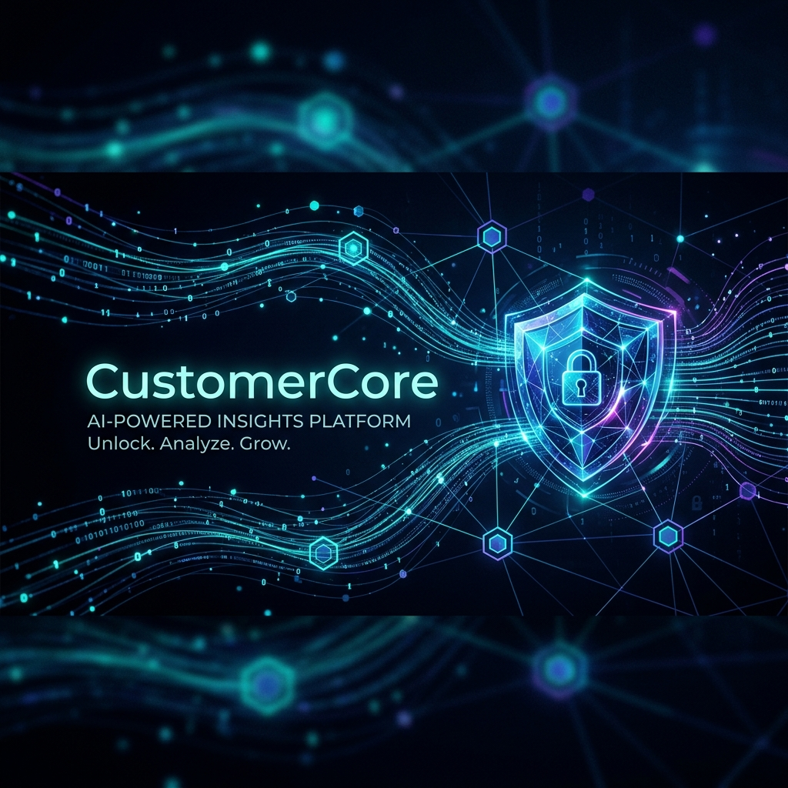
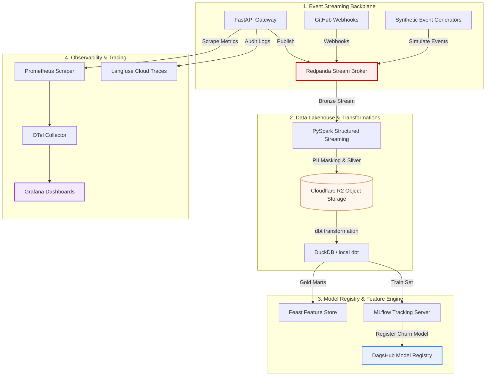
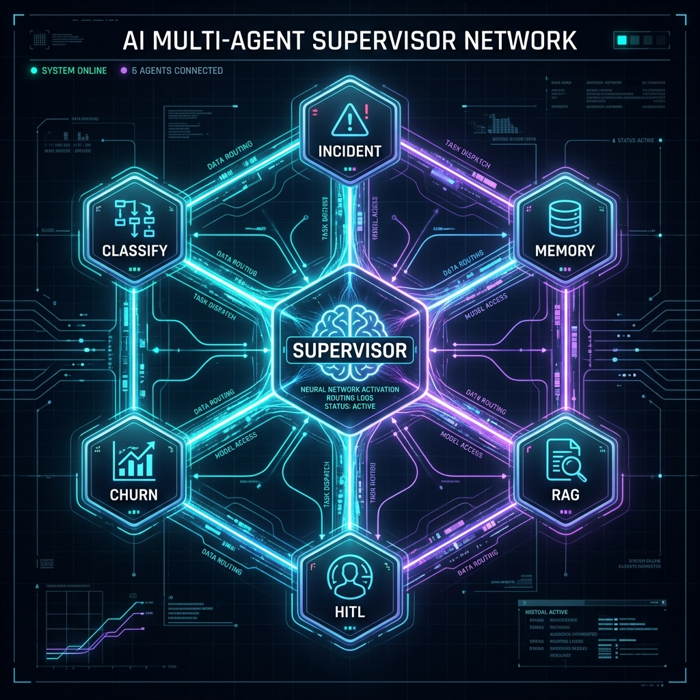

# CustomerCore Intelligence Platform

> **Real-time, multi-tenant B2B customer support intelligence engine.** Decoupled event streaming pipelines, secure cryptographic privacy vaults, stateful multi-agent supervisor networks, and comprehensive MLOps validation.

<p align="left">
  
  
  
  
  
  
</p>

---

## 🔗 Live Operations & MLOps Infrastructure

| Platform Service | Endpoint / Link | Status |
| :--- | :--- | :--- |
| 🖥️ **Operations Console UI** | [huggingface.co/spaces/saibalajiomg/customercore](https://huggingface.co/spaces/saibalajiomg/customercore) |  |
| 📊 **MLflow Experiment Workspace** | [dagshub.com/saibalajinamburi/CustomerCore.mlflow](https://dagshub.com/saibalajinamburi/CustomerCore.mlflow) |  |
| 📦 **DagsHub Model Registry** | [dagshub.com/saibalajinamburi/CustomerCore/models](https://dagshub.com/saibalajinamburi/CustomerCore/models) |  |
| 📂 **DagsHub DVC Storage** | [dagshub.com/saibalajinamburi/CustomerCore](https://dagshub.com/saibalajinamburi/CustomerCore) |  |
| ⚙️ **GitHub CI/CD Actions** | [github.com/saibalajinamburi/CustomerCore/actions](https://github.com/saibalajinamburi/CustomerCore/actions) |  |

---

## 🗺️ Architectural Topology

CustomerCore coordinates raw streaming data, distributed file systems, stateful AI graph execution, and infrastructure observability.



---

## 🛠️ Unified Execution: Local vs. Cloud Mode

The platform runs in two topologies without modifying a single line of business logic:

| Operational Dimension | 💻 Local Development Mode (Full Local) | ☁️ Cloud / Production Mode (HF + Supabase) |
| :--- | :--- | :--- |
| **Ingestion Engine** | Local Redpanda Broker (`localhost:9092`) | Asynchronous Event Streaming queues |
| **Relational Database** | Local SQLite (`customercore.db`) | **Supabase PostgreSQL** (cloud-managed) |
| **Vector Store** | In-Process ChromaDB | **Supabase pgvector** (cryptographically isolated) |
| **PII Protection** | Local Presidio + spaCy sm | Local Privacy Vault (in-process microservice) |
| **Reasoning Model** | Local **Ollama** (`gemma3:4b` / `gemma2:2b`) | Cloud Frontier LLMs via **OpenRouter** gateway |
| **Metrics Collector** | Local Prometheus + local Grafana | Prometheus + OpenTelemetry to **Grafana Cloud** |
| **Telemetry Tracing** | Console Debug Exporter | **Langfuse Cloud** (LLM cost and prompt versioning) |

---

## 🧠 LangGraph Multi-Agent Triage Network

Processing customer support requests relies on a stateful supervisor graph that coordinates six distinct agent nodes:



1.  **Classify Agent**: Evaluates the incoming ticket to categorize it (Billing, Technical, Security) and assign priority (Low, Medium, High, Critical).
2.  **Memory Agent**: Queries **Mem0** using tenant-scoped identifiers to fetch past session memory and customer profile contexts.
3.  **RAG Agent**: Executes hybrid vector (ChromaDB) and keyword (BM25) search on knowledge bases, retrieving past resolutions.
4.  **Churn Agent**: Computes customer churn risk by passing metrics through our custom **Random Forest Classifier**.
5.  **Incident Agent**: Scans incoming ticket frequency to detect systemic infrastructure outages.
6.  **HITL (Human-in-the-Loop) Agent**: Triggers an `interrupt()` block if priority is critical, safety boundaries are crossed, or classifier confidence falls below `0.65`, routing the request to the Supabase operator review queue.

---

## 📊 MLOps: Multi-Model Training & DagsHub Integration

We train and evaluate multiple baseline classifiers, log parameters and datasets, and automatically promote the best model to `"Production"` on DagsHub.

```
DagsHub Repository Page
  ├── Files Tab        <-- Shows dataset and binary weights files versioned by DVC
  ├── Experiments Tab  <-- Compares parameters, F1 metrics, and charts for all runs
  └── Models Tab       <-- Displays the active Production version in the registry
```

### Steps to Train and Register:
1.  **Initialize local virtual environment**:
    ```bash
    source .venv/bin/activate  # Windows: .venv\Scripts\activate
    ```
2.  **Set environment variables**:
    ```powershell
    $env:MLFLOW_TRACKING_USERNAME="YOUR_DAGSHUB_USERNAME"
    $env:MLFLOW_TRACKING_PASSWORD="YOUR_DAGSHUB_TOKEN"
    $env:PYTHONIOENCODING="utf-8"
    ```
3.  **Execute the training pipeline**:
    ```bash
    doppler run -- python -X utf8 src/ml/train_churn.py
    ```
    This script automatically:
    - Trains **Logistic Regression**, **Random Forest**, and **Gradient Boosting** models.
    - Logs parameters, metrics, and artifact plots (ROC Curve, Confusion Matrix) to DagsHub.
    - Registers the Pandas dataset details in the MLflow run.
    - Compares F1-Scores, registers the best model version, and promotes it to the **`Production`** stage in the registry.

4.  **Push dataset files to DVC remote**:
    ```bash
    doppler run -- dvc push
    ```

---

## 🖥️ Local Observability Stack (Grafana & Prometheus)

CustomerCore is pre-provisioned with a local monitoring console to inspect real-time platform diagnostics.

### 1. Spin up base stack + monitoring containers:
```bash
docker compose -f docker-compose.yml -f docker-compose.monitoring.yml up -d
```

### 2. Open dashboards:
*   **Grafana Dashboard**: Open `http://localhost:3000` (pre-loaded with metrics plots, anonymous Admin access).
*   **Prometheus UI**: Open `http://localhost:9090`.

### 3. Visualized metrics panels:
- **Triage Ingestion Rate**: Incoming tickets per second (success vs. pending vs. error).
- **p95 Latency Profiles**: Millisecond duration distribution across ticket priorities.
- **LLM Call Reliability**: API calls volume categorized by model type and status.
- **LLM Cost Tracker**: Cumulative API spend in USD.
- **Semantic Cache Hit Ratio**: Hit vs. miss rates of L1/L2 caches.
- **HITL Reason Distribution**: Breakdown of safety or confidence-based reviews.

---

## 🔒 EU AI Act Compliance Mapping

CustomerCore is built from the ground up to comply with **EU AI Act standards (Article 10-15)**:

*   **Article 10 (Data Governance & Masking)**: Dynamic **Cryptographic Privacy Vault** runs spaCy and Presidio locally in-process to redact names, credit cards, emails, and phone numbers before any database insert or API call.
*   **Article 12 (Audit Traceability)**: Every model decision, input prompt, output resolution, and safety violation is logged into a durable PostgreSQL audit table.
*   **Article 14 (Human-in-the-Loop Oversight)**: High-risk decisions or low-confidence predictions are intercepted and paused using LangGraph checkpointers, waiting for human operator approval before execution.
*   **Article 15 (Fairness & Security)**: Features fairness audits, model cards tracking, and adversarial input-output safety policy checks to prevent jailbreaks.
